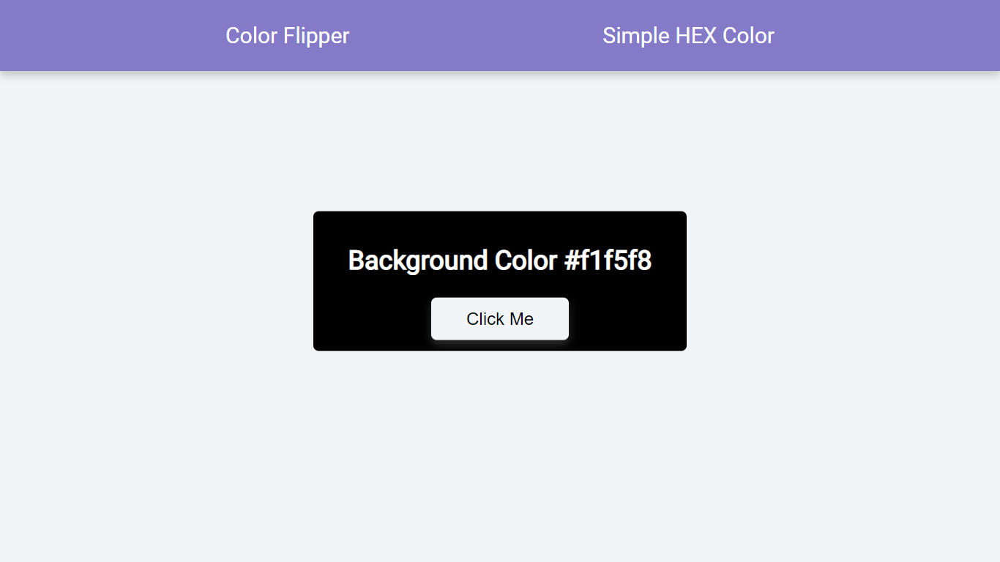

# vanillaJS-Projects

Collection of 15 different basic vanilla JavaScript projects

## 01) Background Color Changer

In this project, I had used vanilla javascript to change the background color on button click and we can also see the color code in hex

