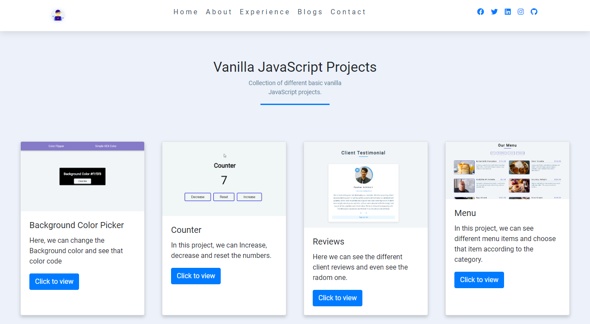

# vanillaJS-Projects

Collection of 15 different basic vanilla JavaScript projects

## 01) Background Color Changer

#### In this project, I had used vanilla javascript to change the background color on button click and we can also see the color code in hex

## 02) Counter

#### Here we can increase , decrease and reset the number

## 02) Review

#### In this project, we can see clients reviews and even see random review on click

